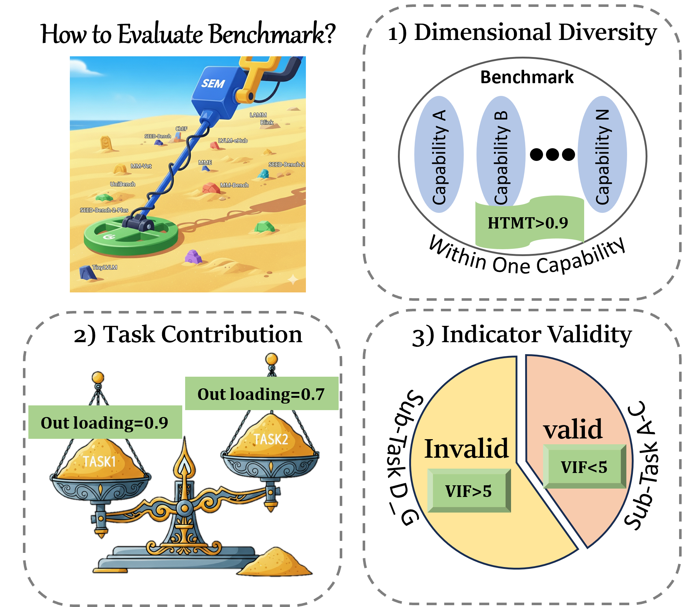
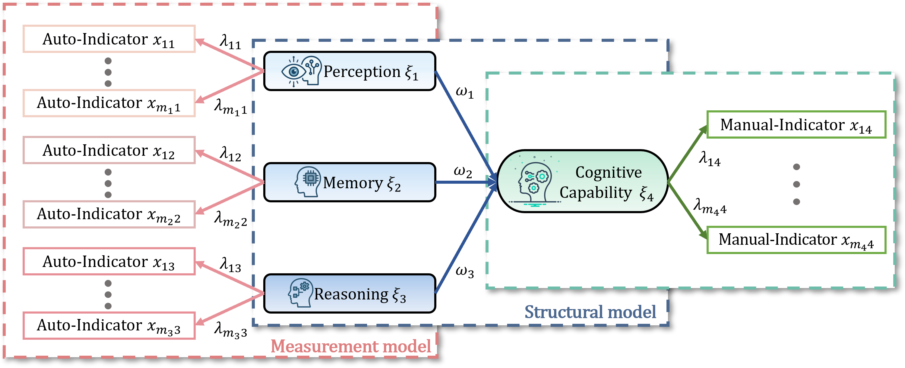
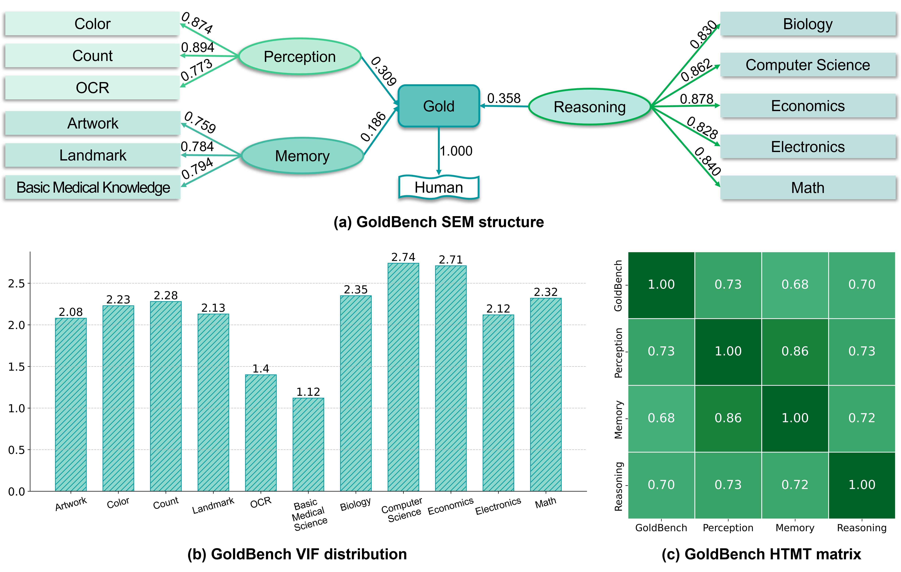
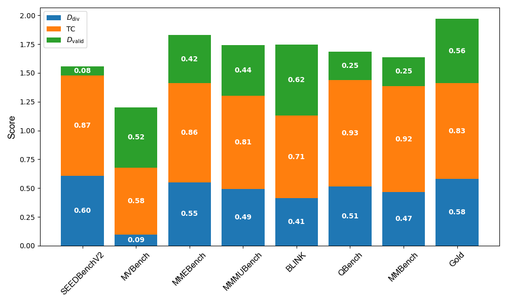
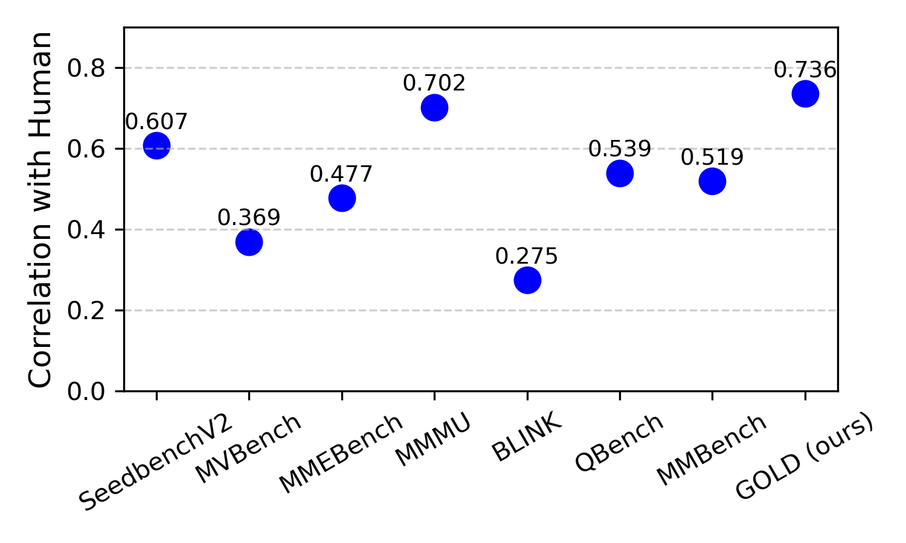
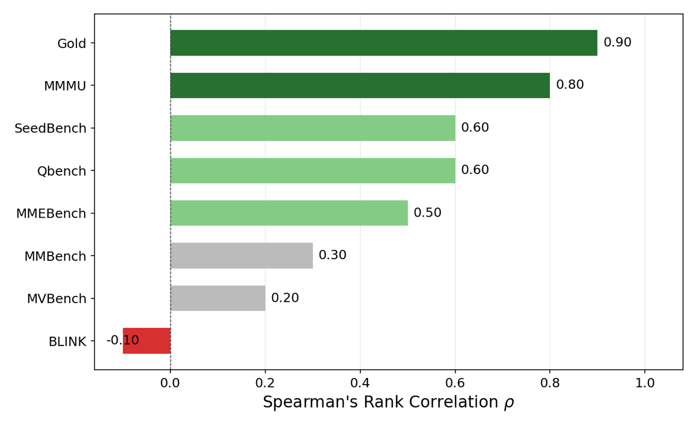

# GOLD

### Aligning MLLM Benchmark With Human Preferences via Structural Equation Modeling

Shengwu Xiong, Tianyu Zou, Cong Wang, Xuelong Li

Official implementation of the SEM-based benchmark evaluation framework and the **GOLD**
benchmark.

---

## Abstract

Evaluating multimodal large language models (MLLMs) remains a fundamental challenge due to a
lack of structured, interpretable, and theoretically grounded benchmark designs. Existing
benchmarks often adopt heuristic-based task groupings with unclear cognitive targets, thus
resulting in overlapping abilities, redundant indicators, and limited diagnostic power. To
address these issues, we propose a novel framework for evaluating MLLM benchmark based on
structural equation modeling to analyze and quantify internal validity, dimensional
separability, and contribution of benchmark components. Motivated by the observed limitations
of current designs, we further introduce a novel capability hierarchy grounded in Piaget's
theory of cognitive development, dividing MLLM abilities into three hierarchical layers, i.e.,
Perception, Memory, and Reasoning. Furthermore, we design a benchmark evolution pipeline to
retain low-redundancy, high-contribution tasks from raw candidate pools, yielding a refined
benchmark dubbed GOLD. Extensive experimental results demonstrate that the proposed benchmark
exhibits stronger interpretability, reduced indicator redundancy, and clearer cognitive
consistency compared to existing approaches.

---

## Motivation

<p align="center">
  
</p>
<p align="center"><em>Brief illustrations of how to evaluate a benchmark.</em></p>

Over 300 MLLM benchmarks now exist, and recent ones keep expanding their task counts and
capability dimensions — SEED-Bench went from 2 dimensions / 12 tasks to 6 / 27, MMT-Bench
declares 32 dimensions and 162 tasks. But the groupings are heuristic, so abilities overlap,
indicators become redundant, and it is unclear which benchmarks actually say something about
model capability. We treat this as a measurement problem: task scores are *observed
indicators* of *latent capabilities*, which is exactly what SEM was built to model.

## Framework

<p align="center">
  
</p>
<p align="center"><em>An architecture of the SEM-based evaluation framework.</em></p>

A reflective measurement model links observed task scores to latent capabilities,
$X = \Lambda_x \xi + \delta$, with a structural model $\eta = B\eta + \Gamma\xi + \zeta$ over
the latent variables. Estimation uses **PLS-SEM**, which is distribution-free, robust on small
samples, and predictively oriented. Three diagnostics summarize a benchmark:

| Metric | Definition | Reads as |
| --- | --- | --- |
| $D_{\mathrm{div}}$ | $\min(1,\ 1 / (2\max_{i \neq j}\mathrm{HTMT}_{ij}))$ | are the capability dimensions separable? |
| $\mathrm{TC}$ | mean \| outer loading \| | do tasks inform their construct? |
| $D_{\mathrm{valid}}$ | $(\prod_j \mathrm{VIF}_j)^{-1/n}$ | are indicators non-redundant? |

## The GOLD benchmark

<p align="center">
  
</p>
<p align="center"><em>Structural analysis of GOLD by using the SEM-based framework.</em></p>

Following Piaget's stages of cognitive development, capabilities are stratified into three
layers, and the evolution pipeline distills a candidate pool of 85 tasks down to 11:

| Layer | Piaget stage | Tasks |
| --- | --- | --- |
| **Perception** | Sensorimotor | Color, Count, OCR |
| **Memory** | Preoperational | Artwork, Landmark, BMK |
| **Reasoning** | Concrete & Formal Operational | Biology, CS, Economics, Electronics, Math |

Reliability and validity of the resulting constructs:

| Metric | Memory | Perception | Reasoning |
| --- | --- | --- | --- |
| Cronbach's $\alpha$ | 0.702 | 0.804 | 0.902 |
| Reliability | 0.732 | 0.813 | 0.906 |
| Composite reliability | 0.823 | 0.885 | 0.927 |
| Convergent validity | 0.707 | 0.720 | 0.719 |
| SRMR | | 0.087 | |
| $R^2$ | | 0.557 | |

## Results

<p align="center">
  
</p>
<p align="center"><em>Diagnostic metrics for existing MLLM benchmarks across four dimensions.</em></p>

GOLD achieves the best balance across the three dimensions with the highest overall score
(1.97). MVBench shows the most entangled constructs ($D_{\mathrm{div}}=0.09$); SEEDBenchV2
the weakest indicator validity ($D_{\mathrm{valid}}=0.08$). QBench and MMBench score high on
TC (0.93, 0.92) but pay for it in redundancy.

<p align="center">
  
  
</p>
<p align="center"><em>Left: Pearson correlation with human evaluation (Chatbot Arena). Right: Spearman's rank correlation with 12 multi-disciplinary annotators.</em></p>

GOLD aligns most closely with human judgment on both protocols — Pearson $r = 0.7359$ against
Chatbot Arena Elo, and Spearman $\rho = 0.90$ against the consensus ranking of 12 annotators.
BLINK and MVBench correlate weakly (0.2746, 0.369).

Threshold ablation, which fixes the operating point:

| $\delta_{\mathrm{VIF}}$ | $\lambda_{\min}$ | task_num | TC | $D_{\mathrm{div}}$ | $D_{\mathrm{valid}}$ | overall |
| --- | --- | --- | --- | --- | --- | --- |
| **5** | **0.75** | **11** | **0.83** | **0.58** | **0.56** | **1.97** |
| 5 | 0.80 | 9 | 0.86 | 0.47 | 0.58 | 1.91 |
| 5 | 0.70 | 15 | 0.77 | 0.48 | 0.46 | 1.71 |
| 3 | 0.75 | 11 | 0.83 | 0.58 | 0.56 | 1.97 |
| 7 | 0.75 | 16 | 0.79 | 0.42 | 0.38 | 1.59 |

---

## How to filter tasks

### Stage 1 — Assign each candidate task to a capability layer

Assign by **what the task requires of the model**, not by its surface format or subject matter.
The decisive test is the *minimal* competence needed for a correct answer:

| Layer | Assign a task here if… | Example |
| --- | --- | --- |
| **Perception** | it is answerable **from the image alone**, with no external prior knowledge | *"How many people are in this photo?"* |
| **Memory** | it requires **retrieving stored knowledge** cued by the image | *"Who painted this?"* — perception locates the painting, the answer lives in pretraining |
| **Reasoning** | it requires **multi-step deduction or causal inference** over what is perceived | *"Given this circuit, what is the voltage at node B?"* |

Layers are cumulative — reasoning items still require perception — so a task belongs to the
layer of its *bottleneck*, the hardest step it demands. That is what keeps the constructs
separable. Start each layer with three or more tasks, since stage 2 deletes some.

### Stage 2 — Prune, automatically

The measurement model is re-estimated and the single worst-offending task deleted, repeatedly:

| Threshold | Default | Deletes a task when | Because |
| --- | --- | --- | --- |
| $\delta_{\mathrm{VIF}}$ | **5.0** | VIF > 5 | it is **redundant** — its block-mates already predict its scores, so it adds cost and inflates apparent reliability without adding information |
| $\lambda_{\min}$ | **0.75** | \| loading \| < 0.75 | it is a **weak indicator** — the construct explains under ~56% of its variance, so most of its signal is something else |

Three properties of the loop matter:

- **Redundancy is judged before contribution.** A near-duplicate absorbs variance from its
  neighbours and depresses their loadings, so a task can look weak purely because a twin is
  standing next to it.
- **One deletion per refit.** Removing a collinear task changes every other VIF and loading in
  its block; batch deletion over-prunes.
- **Every construct keeps a floor** (`min_indicators`, default 2). When the floor blocks a
  deletion the run stops and says which tasks it would otherwise have removed — a signal to
  widen that layer's pool, not a clean result.

### Stage 3 — Validate what survived

Pruning is not self-certifying. Confirm reliability (Cronbach's $\alpha$, composite
reliability ≥ 0.70), convergent validity (AVE ≥ 0.50), discriminant validity (HTMT < 0.90),
and fit (SRMR ≤ 0.08) before adopting the reduced set. Then check that the refined benchmark
correlates with human preference *better* than the pool did — the claim the whole procedure
exists to support.

Note that $D_{\mathrm{valid}}$ is sensitive to task count: it falls as tasks are added even
when they are sound, so read it as a before/after comparison within one run rather than an
absolute grade.

---

## Usage

```bash
pip install -r requirements.txt
```

```bash
# Audit an existing benchmark: fit once, report diagnostics, no pruning
python -m goldbench evaluate --scores scores.csv --spec specs/gold.json

# Run the evolution pipeline (Algorithm 1) on a candidate pool
python -m goldbench select --scores scores.csv --spec specs/pool.json --outdir runs/mine

# Sweep thresholds to reproduce the ablation
python -m goldbench ablate --scores scores.csv --spec specs/pool.json
```

```python
from goldbench import BenchmarkSpec, load_scores, run_pipeline

outcome = run_pipeline(load_scores("scores.csv"),
                       BenchmarkSpec.from_file("specs/pool.json"))
print(outcome.retained_tasks, outcome.removed_tasks)
print(outcome.comparison_table())        # diagnostics, initial vs final
```

**Inputs.** A score matrix with one row per model and one column per task (CSV/TSV/JSON/XLSX)
— models are the sample, so PLS-SEM estimates from variance across them. Optionally a column
of external human preference (Chatbot Arena Elo in the paper) to anchor the model. Plus a spec
file assigning tasks to constructs:

```json
{
  "structure": "anchor",
  "human_column": "arena_elo",
  "thresholds": { "vif_max": 5.0, "loading_min": 0.75, "min_indicators": 2 },
  "constructs": {
    "Perception": ["Color", "Count", "OCR"],
    "Memory":     ["Artwork", "Landmark", "BMK"],
    "Reasoning":  ["Biology", "CS", "Economics", "Electronics", "Math"]
  }
}
```

## Citation

```bibtex
@article{xiong2025gold,
  title   = {Aligning MLLM Benchmark With Human Preferences via Structural Equation Modeling},
  author  = {Xiong, Shengwu and Zou, Tianyu and Wang, Cong and Li, Xuelong},
  year    = {2025}
}
```
